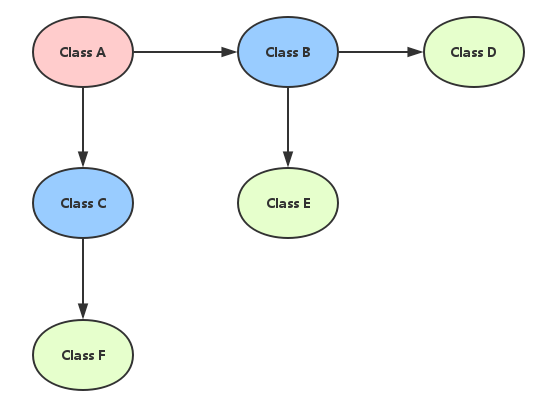

# Mockito

# 什么是Mock测试

mock 测试就是在测试过程中，创建一个假的对象，避免你为了测试一个方法，却要自行构建整个 bean 的依赖链

像是以下这张图，类 A 需要调用类 B 和类 C，而类 B 和类 C 又需要调用其他类如 D、E、F 等，假设类 D 是一个外部服务，那就会很难测，因为你的返回结果会直接的受外部服务影响，导致你的单元测试可能今天会过、但明天就过不了了



而当我们引入 mock 测试时，就可以创建一个假的对象，替换掉真实的 bean B 和 C，这样在调用B、C的方法时，实际上就会去调用这个假的 mock 对象的方法，而我们就可以自己设定这个 mock 对象的参数和期望结果，让我们可以专注在测试当前的类 A，而不会受到其他的外部服务影响，这样测试效率就能提高很多

# 使用场景：

- 提前创建测试; TDD（测试驱动开发）
- 团队可以并行工作
- 你可以创建一个验证或者演示程序
- 为无法访问的资源编写测试
- Mock 可以交给用户
- 隔离系统

# 概念

桩函数(stub)：桩函数实际上是白盒测试中的概念，意思是使用一些自己定义的测试函数来替换当前需要测试的函数。被替换的函数可能是目前还没写完的，这样能够加速开发，或更好的找错误源。

打桩（存根）：模拟要调用的函数（打桩对象），给它提供桩函数，给桩函数返回一个值。简单的说自定义输入输出，不打桩默认返回null。

mock和stub：
相同点：Stub和Mock对象都是用来模拟外部依赖，使我们能控制。
不同点：而stub完全是模拟一个外部依赖，用来提供测试时所需要的测试数据。而mock对象用来判断测试是否能通过，也就是用来验证测试中依赖对象间的交互能否达到预期。在mocking框架中mock对象可以同时作为stub和mock对象使用，两者并没有严格区别。

# 常用注解

## @Mock：

@Mock 是 Mockito 提供的注解，用于生成模拟对象,是创建了一个新的对象。这里的 userDao 和 webServiceClient 是通过 Mockito 模拟的对象，而不是 Spring 容器中的实际 bean。它们的行为可以通过 when/thenReturn 或其他模拟方法来定义。

注意：当你使用 Mockito 的 @Mock 注解来 mock 一个类时，即使该类已经实现了部分方法，Mockito 也会拦截这些方法的调用。这意味着，默认情况下，Mockito 会模拟这个类的所有方法（包括已经实现的方法），除非你显式定义模拟行为。

因此，当你通过 @Mock 来 mock 一个已经实现部分方法的类时：

如果你调用了已经实现的方法，并且没有为这个方法定义具体的 when/thenReturn 行为，Mockito 会返回 默认值（例如 null、0、false 等），而不会执行类中的实际实现。
如果你想让某些方法在调用时执行它们的实际实现，你需要使用 Mockito 提供的 spy() 功能。

## @Spy

@Spy 创建的对象是真实对象的部分模拟（Partial Mock），它会调用对象的真实方法，而只有那些明确模拟的方法才会被替换成模拟的行为。spy() 提供部分模拟功能。未被显式模拟的方法将调用实际实现，已经被模拟的方法则返回预设的模拟值。

在使用 @InjectMocks 时，Mockito 会将 @Mock 和 @Spy 注解的对象注入到被测试的对象中。如果某个依赖项使用了 @Spy，Mockito 会确保被注入的是该对象的部分模拟实现。

### **`spy()` 与 `mock()` 的对比**

| **特性** | **`mock()`** | **`spy()`** |
| --- | --- | --- |
| 默认行为 | 模拟所有方法，返回默认值（如 `null`） | 调用真实的实现，除非被显式模拟 |
| 是否执行实际代码 | 不执行 | 执行实际的代码实现 |
| 定义模拟行为时是否拦截 | 会拦截并返回模拟值 | 如果定义了模拟行为，使用模拟值，没定义则执行实际实现 |

## @InjectMocks：

@InjectMocks 是 Mockito 的一个注解，用于将模拟对象（即用 @Mock 创建的对象）注入到被测对象中（这里是 UserService）。
Mockito 会创建一个新的 UserService 对象，并将 userDao 和 webServiceClient 作为依赖注入到这个新的对象中。
这与 Spring 容器的行为无关。即使 UserService 已经通过 @Service 注解注册到了 Spring 容器中，在使用 @InjectMocks 时，Mockito 会创建并管理一个全新的 UserService 对象。

```java

public class UserDao {
    User getUserById(int userId)
    {
        return new User(1,"张三");
    }
    int saveUser(User user);
}

//WebServiceClient定义
public class WebServiceClient {
    boolean isServiceAvailable();
    String getUserDataFromWebService(int userId);
}

@Service
//UserService依赖于UserDao以及WebServiceClient
public class UserService {
	
    @Autowired
    private UserDao userDao;

    @Autowired
    private WebServiceClient webServiceClient;
    
    //省略操作
}
```

```java
public class UserServiceTest {
    // 使用@Spy部分模拟UserDao对象
    @Spy
    private UserDao userDao;

    // 模拟WebServiceClient对象
    @Mock
    private WebServiceClient webServiceClient;

    // 根据依赖将mock对象注入到UserService中
    @InjectMocks
    private UserService userService;
    
    //必须首先初始化
    @BeforeEach
    public void setUp() {
        //非常重要！！！！！
        MockitoAnnotations.openMocks(this);  // 初始化Mockito
    }
    
    @Test
    void Spytest()
    {
        //模拟saveUser方法，而调用getUserById为其真实实现
        doReturn(1).when(userDao).saveUser(any(User.class));
        //真实行为
        User FoundUser = userDao.getUserById(1);// User张三
        //模拟行为
        userDao.saveUser(FoundUser);// 返回1
        
	}
    
    //省略其他测试方法
}
```

# 测试流程：

使用 Mockito 进行测试的一般流程可以分为以下几个步骤：

1. 设置测试环境：在单元测试中，通过 Mockito 的注解或者方法来创建模拟对象（Mock）。模拟对象是用于替代真实的依赖，以便控制和测试不同的场景。
2. 定义模拟行为：使用 Mockito 的方法定义模拟对象的方法行为。通常通过 when(...).thenReturn(...) 来模拟返回特定值，或者使用 doThrow() 来模拟异常抛出。
3. 执行测试代码：编写业务逻辑代码，将模拟对象注入依赖进行测试并断言结果。
验证行为：使用 verify() 验证方法调用、参数、调用次数等。

## 定义模拟行为：

### 使用 when(...).thenReturn(...) 来模拟方法返回值。

这是最常用的方式。适用于模拟方法调用后需要返回某个特定值的情况。

示例：模拟 UserDao 的 getUserById() 方法在调用时返回特定的 User 对象。

```java
@Mock
private UserDao userDao;

@Test
public void testGetUser() {
    // 模拟getUserById方法，当传入用户ID为1时，返回一个新的User对象
    when(userDao.getUserById(1)).thenReturn(new User(1, "John"));

    // 调用测试方法
    User user = userDao.getUserById(1);

    // 断言结果
    assertEquals("John", user.getName());
}
```

### 使用 doReturn(...).when(...) 来避免方法的真实调用。

与 `when(...).thenReturn(...)` 类似，但适用于某些特殊情况，例如需要避免实际调用真实方法（尤其是部分模拟 **`@Spy`** 时），或者处理 `void` 方法的情况。

```java
@Spy
private UserDao userDao;

@Test
public void testSaveUser() {
    // 避免调用真实的saveUser方法
    doReturn(1).when(userDao).saveUser(any(User.class));

    // 调用saveUser方法
    userDao.saveUser(new User(2, "Doe"));

    // 验证saveUser确实被调用过一次
    verify(userDao, times(1)).saveUser(any(User.class));
```

### when.thenReturn和doReturn.when的区别

1. when(...).thenReturn(...)
这是 Mockito 的标准使用方式，用于定义当某个方法被调用时返回指定的值。它适用于绝大多数场景，尤其是当你使用完全模拟对象（即 @Mock）时。
    
    这种写法会去实际执行代码，然后返回指定值
    
    ```java
    when(userDao.getUserById(2)).thenReturn(null);
    ```
    
    工作原理：Mockito 在内部是通过调用 userDao.getUserById(2) 方法，并在该方法执行后记录这个调用，然后当方法被再次调用时，返回 null。
    调用时机：when(...).thenReturn(...) 实际上会首先调用目标方法 getUserById(2)，然后再返回指定的结果。如果目标方法是有副作用的（比如修改某些状态），它会先执行副作用，再进行模拟。
    

1. doReturn(...).when(...)
    
    doReturn(...).when(...) 是 Mockito 中的另一种方法，主要用于避免方法调用本身带来的副作用，尤其是在 **部分模拟**（@Spy）的场景中非常有用。
    
    **这种写法不会执行代码，直接返回指定值。**
    
    ```java
    doReturn(null).when(userDao).getUserById(2);
    ```
    
    工作原理：doReturn(null) 先定义了模拟的返回值，然后使用 when(userDao) 来指定在 getUserById(2) 方法被调用时返回 null，而不会先调用 getUserById(2) 方法的真实实现。
    调用时机：doReturn(...).when(...) 不会实际调用目标方法，因此不会触发任何真实方法的执行。如果目标方法有副作用或复杂的逻辑，使用 doReturn(...) 可以避免这些问题。
    

使用 thenThrow(...) 或 doThrow(...).when(...) 来模拟异常。

使用 doNothing() 来处理 void 方法。

### 使用 thenAnswer(...) 来处理复杂的动态行为。

thenAnswer()允许你根据传入的参数、方法的调用上下文、甚至外部状态来动态地生成返回值或执行特定逻辑。相比于 thenReturn() 这种简单的返回值模拟方式，thenAnswer() 提供了更大的灵活性。

**thenAnswer() 的主要特点：**

1. 基于输入参数动态响应：你可以根据方法的输入参数来生成不同的返回结果。
2. 执行自定义逻辑：它允许你在模拟方法中执行特定的自定义逻辑，而不仅仅是返回一个固定值
3. 复杂行为模拟：适用于更复杂的业务场景，比如多个条件组合下的不同返回值，或者需要根据传入参数执行计算等。

**thenAnswer() 使用方法**
thenAnswer() 接受一个 Answer 接口的实现作为参数。Answer 接口定义了一个 answer(InvocationOnMock invocation) 方法，该方法会在模拟方法被调用时执行。你可以通过这个方法来访问方法的调用信息（包括传入的参数），并根据需要自定义返回结果或逻辑。

InvocationOnMock 接口提供了几个常用的方法，允许你访问模拟方法调用的详细信息：

getMock()：返回当前被调用的模拟对象。
getMethod()：返回被调用的 Method 对象。
getArguments()：返回方法的所有传递参数的数组。
getArgument(int index)：返回指定索引位置的单个参数。
getArgument(int index, Class<T> clazz)：返回指定索引的参数并强制转换为指定类型。
getArgumentsCount()：返回传递的参数数量。
callRealMethod()：调用被模拟方法的真实实现（常用于部分模拟 @Spy）。

```java
@Mock
private UserDao userDao;

@Test
public void testGetUserThrowsException() {
    // 使用thenAnswer来模拟不同的异常抛出条件
    when(userDao.getUserById(anyInt())).thenAnswer(new Answer<User>() {
        @Override
        public User answer(InvocationOnMock invocation) throws Throwable {
            int userId = invocation.getArgument(0);
            if (userId < 0) {
                throw new IllegalArgumentException("User ID cannot be negative");
            }
            return new User(userId, "User" + userId);
        }
    });

    // 验证抛出异常
    assertThrows(IllegalArgumentException.class, () -> {
        userDao.getUserById(-1);
    });

    // 正常调用不抛异常
    User user = userDao.getUserById(1);
    assertEquals("User1", user.getName());
}
```

## 执行测试代码并断言

编写测试代码，调用被测类中的方法。由于被测类的依赖已经被模拟对象替换，所以你可以专注于测试当前方法的逻辑，而不必担心真实依赖带来的副作用。在执行完测试代码后，你可以通过 JUnit 的断言 来检查测试结果是否符合预期。常用的断言包括 assertEquals()、assertTrue()、assertNull() 等。

JUnit 常用的断言方法
在 JUnit 5 中，所有断言方法都位于 org.junit.jupiter.api.Assertions 类中。常见的断言包括：

- assertEquals(expected, actual)：断言两个值是否相等。
- assertNotEquals(unexpected, actual)：断言两个值是否不相等。
- assertTrue(condition)：断言条件为 true。
- assertFalse(condition)：断言条件为 false。
- assertNull(object)：断言对象是否为 null。
- assertNotNull(object)：断言对象是否不为 null。
- assertSame(expected, actual)：断言两个对象引用是否指向同一个对象。
- assertNotSame(unexpected, actual)：断言两个对象引用是否不指向同一个对象。
- assertThrows(expectedType, executable)：断言执行代码时抛出特定类型的异常。
- assertTimeout(duration, executable)：断言在指定的时间内执行完成。

## 验证

- verify()：验证某个模拟对象的方法是否被调用。
- verifyNoMoreInteractions()：验证某个模拟对象的方法在指定的调用之外，没有其他额外的调用。
- verifyZeroInteractions() / verifyNoInteractions()：验证某个模拟对象从未被调用。
- InOrder：验证多个方法调用的顺序。
- times()：验证某个方法被调用的次数。
- never()：验证某个方法从未被调用。
- atLeast() 和 atMost()：验证某个方法至少/至多被调用多少次。

```java
@Mock
private UserDao userDao;

@Test
public void testVerifyMethodCall() {
    // 模拟getUserById方法的行为
    when(userDao.getUserById(1)).thenReturn(new User(1, "John"));

    // 调用被测方法
    User user = userDao.getUserById(1);

    // 验证getUserById方法是否被调用过
    verify(userDao).getUserById(1);
}

```

```java
@Mock
private UserDao userDao;

@Test
public void testVerifyCallTimes() {
    // 模拟调用行为
    when(userDao.getUserById(1)).thenReturn(new User(1, "John"));

    // 调用多次方法
    userDao.getUserById(1);
    userDao.getUserById(1);

    // 验证getUserById方法被调用了2次
    verify(userDao, times(2)).getUserById(1);
}

```

```java
@Mock
private UserDao userDao;

@Test
public void testVerifyNeverCalled() {
    // 调用其他方法
    userDao.saveUser(new User(1, "John"));

    // 验证getUserById方法从未被调用
    verify(userDao, never()).getUserById(1);
}

```